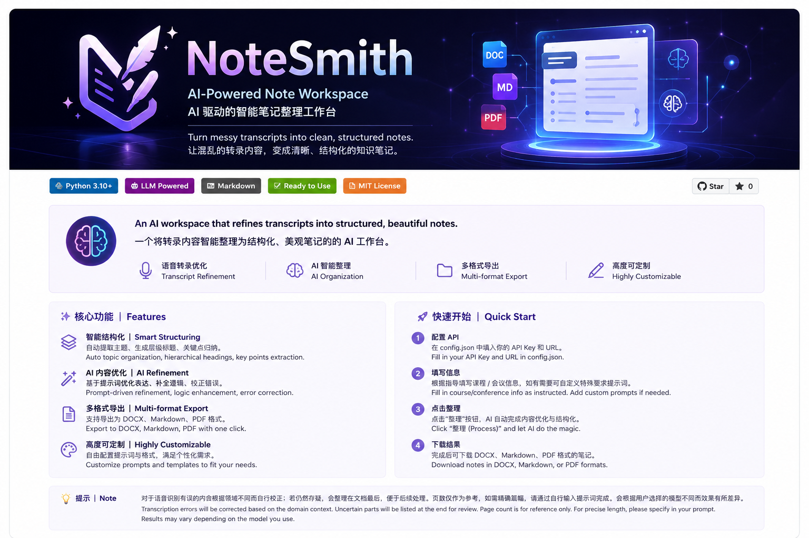

<div align="center">



# ✨ NoteSmith

### 🧠 AI-Powered Note Workspace ｜ AI 智能笔记工作台

<p>
  
  
  
  
</p>

<p>
Turn messy transcripts into clean and structured notes.
<br>
将杂乱课堂记录自动整理为清晰、结构化的学习笔记。
</p>

</div>

---

# 🚀 Features ｜ 功能特性

### 📝 Smart Structuring ｜ 智能结构化

* Auto topic organization ｜ 自动主题整理
* Multi-level headings ｜ 自动生成层级标题
* Key point extraction ｜ 重点内容提取
* Readable formatting ｜ 优化阅读排版

### ⚡ AI Workflow ｜ AI 工作流

* Prompt-based refinement ｜ Prompt 驱动整理
* Semantic polishing ｜ 语义润色优化
* Structured generation ｜ 结构化生成
* Markdown export ｜ Markdown 导出支持

### 📚 Study Friendly ｜ 面向学习场景

* Lecture transcript cleanup ｜ 课堂转录整理
* Formula preservation ｜ 保留公式与术语
* Domain-aware correction ｜ 根据不同领域自动校正语音识别错误
* Uncertain content appendix ｜ 存疑内容自动整理至文档末尾
* Review-oriented layout ｜ 面向复习的布局
* Obsidian / Notion ready ｜ 支持 Obsidian / Notion

---

# 🧩 Why NoteSmith? ｜ 为什么使用 NoteSmith？

### ❌ Before ｜ 传统方式

* Messy copied text ｜ 杂乱复制内容
* Hard-to-review notes ｜ 笔记难以复习
* Manual organization ｜ 手动整理耗时

### ✅ After ｜ 使用后

```text
Raw Transcript
      ↓
AI Structuring
      ↓
Clean Study Notes
```

让 AI 自动完成：

* 内容整理
* 结构优化
* 知识分层
* 学习型排版

---

# ⚙️ Tech Stack ｜ 技术栈

```text
Python
LLM APIs
Markdown
Prompt Engineering
```

---

# 🛠️ Quick Start ｜ 快速开始

### 1️⃣ Configure API ｜ 配置 API

在 `config.json` 中填入自己的：

* API Key
* API URL
* 模型名称

并根据指引填写课程 / 会议相关信息。

如有需要，也可以自行添加特殊 Prompt 来满足个性化整理需求。

---

### 2️⃣ Run ｜ 运行项目

```bash
python main.py
```

---

### 3️⃣ Export ｜ 导出结果

整理完成后可导出：

* DOCX
* Markdown
* PDF

也可以自行修改 HTML 内置 Prompt 与模板，以满足不同格式与整理风格需求。

⚠️ 页数仅作为参考。
如需严格控制篇幅，请自行输入额外 Prompt。

最终效果会因用户选择的模型不同而存在差异。

---

# 📌 Roadmap ｜ 开发计划

* [ ] Improve export & download workflow ｜ 完善导出与下载流程
* [ ] Better long-document organization ｜ 优化长文档整理与篇幅控制

---

# 📄 License

MIT License

---

<div align="center">

### ⭐ Star this project if you like it.

### ⭐ 如果你喜欢这个项目，欢迎 Star。

</div>
=======
# NoteSmith
AI-powered note refinement workspace
>>>>>>> b899f9a7316014d406d46d889f5afe71e254c986
